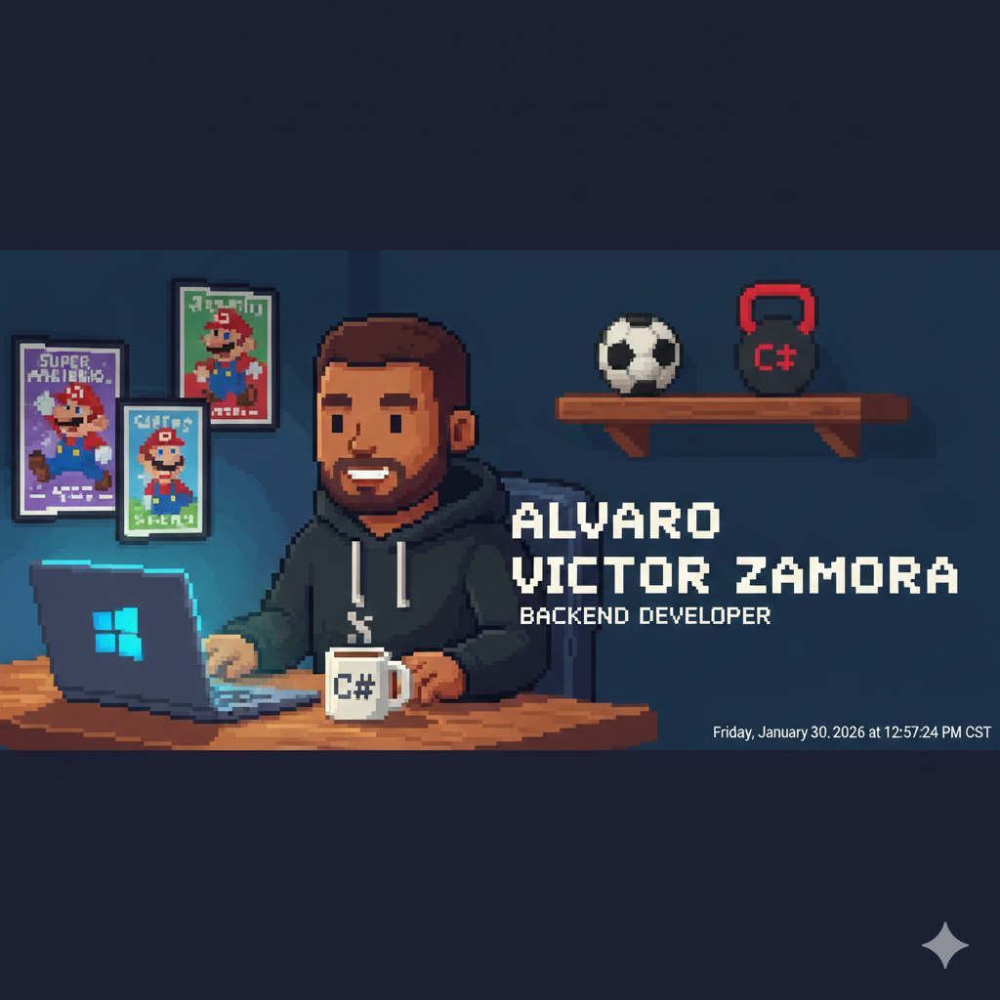

  

# Hi, I'm Alvaro Victor Zamora! 👋

### 🚀 Backend Developer | .NET & Software Architecture Enthusiast

I am a passionate Software Developer focused on building high-performance RESTful APIs and scalable distributed systems. My goal is to write clean, maintainable code while solving real-world problems through technology.

---

### 🛠️ Tech Stack

- **Languages:** C#, SQL, JavaScript.
- **Frameworks & Libs:** .NET 8, Entity Framework Core, MediatR, FluentValidation.
- **Tools & DevOps:** SQL Server, Git, Docker, JWT, Swagger.
- **Architecture:** Clean Architecture, Domain-Driven Design (DDD).

---

### ☕ Featured Project: [CoffeeLocator](https://github.com/alvi014/CoffeeLocator)
*A robust RESTful API for coffee enthusiasts to discover and rate local shops.*
- Built with **.NET 8** and **Clean Architecture**.
- Features **JWT Authentication** and **Geographic Proximity Search**.

---

### 📈 GitHub Statistics

---

### 📫 Let's Connect!

---
*"Code is like coffee: it's better when it's strong and well-filtered."* ☕
