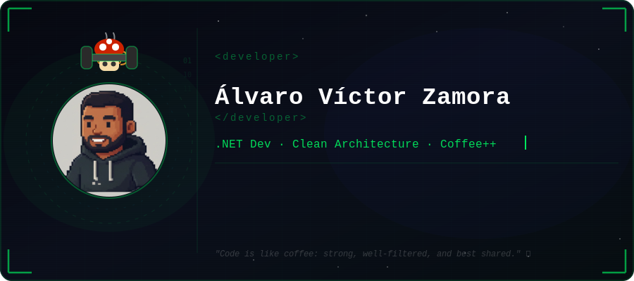

<div align="center">

<!-- BANNER -->


<br/>

<!-- TYPING ANIMATION -->
[](https://git.io/typing-svg)

<br/>

<!-- PROFILE VIEWS + SOCIAL BADGES -->

[](https://linkedin.com/in/álvaro-víctor-zamora-385965210)
[](mailto:alvarovictor06@gmail.com)
[](https://wa.me/50687221109)
[](https://instagram.com/alvi014)

</div>

---

## `> whoami`

```typescript
const alvaro: Developer = {
  name:       "Álvaro Víctor Zamora",
  role:       ".NET Backend Developer & Software Architect",
  location:   "Costa Rica 🇨🇷",
  focus:      ["RESTful APIs", "Clean Architecture", "Distributed Systems"],
  currentlyBuilding: "CoffeeLocator — location-based API with DDD + .NET 8",
  
  offTheKeyboard: {
    fuel:     "☕ Strong black coffee, no sugar",
    sport:    "🏋️ CrossFit | ⚽ Soccer | 🏊 Swimming | 🏃 Running",
    vibes:    "🎮 Retro games & pixel art (Mario Bros forever)",
    core:     "👨‍👩‍👧 Family first, always",
  },

  philosophy: "Code is like coffee — strong, well-filtered, and best shared.",
};
```

---

## `> tech --stack`

<div align="center">

### 🧠 Languages


### ⚙️ Backend & Frameworks


### 🎨 Frontend


### 🗄️ Databases & ORM


### 🛠️ DevOps & Tools


### 🔐 Security & Patterns


</div>

---

## `> ls projects/`
 [](https://github.com/alvi014?tab=repositories)
<div align="center">

### ☕ CoffeeLocator

</div>

> *Find the perfect coffee shop near you — built API-first with scalability in mind.*


```
📁 CoffeeLocator/
├── 🏗️  Architecture  →  Clean Architecture + DDD
├── 🔧  Backend       →  .NET 8 + ASP.NET Core
├── 🔐  Auth          →  JWT Authentication
├── 📍  Feature        →  Geographic Proximity Search
├── 📖  Docs          →  Swagger / OpenAPI
├── 🎨  Frontend      →  Angular 
├── 🐳  Container     →  Docker
└── 🚧  Status        →  Active Development
```

<div align="center">

[](https://github.com/alvi014/CoffeeLocator)
[]()


</div>

---
<div align="center">

### 🚗 TicoAutos

</div>

> *Professional car sales marketplace — engineered with Clean Architecture and enterprise patterns.*
```
📁 TicoAutos/
├── 🏗️  Architecture  →  Clean Architecture (Onion)
├── 🔧  Backend       →  .NET 8/9 + ASP.NET Core
├── 🔐  Auth          →  JWT + Identity Management
├── 📦  Patterns      →  Unit of Work & Repository
├── 📡  Interaction   →  Real-time Q&A System
├── 🎨  Frontend      →  Angular (Standalone)
├── 🐳  DevOps        →  Docker + GitFlow
└── 🚧  Status        →  Active Development (Sprint 1)
```

<div align="center">

[](https://github.com/alvi014/TicoAutos)
[]()


</div>

---

## `> git log --stats`

<div align="center">


<br/><br/>


</div>

---

## `> tail -f activity.log`

<div align="center">


</div>

---

## `> cat achievements.txt`

<div align="center">

| 🏆 | Achievement | Details |
|:---:|:---|:---|
| 🏗️ | **Architecture First** | Learning to build modular software |
| ☕ | **Coffee-Driven Dev** | Proven correlation between coffee cups and commits |
| 🎮 | **Retro at Heart** | Mario Bros fan since cartridge era |
| 🏋️ | **Code & Lift** | CrossFit PRs and Git PRs — both count |
| 🚀 | **API Craftsman** | Obsessed with clean, documented, scalable REST APIs |
| 🌍 | **Costa Rica 🇨🇷** | Building from the tropics |

</div>

---

## `> ping alvaro`

<div align="center">

*Currently open to new opportunities and collaborations.*

[](https://linkedin.com/in/álvaro-víctor-zamora-385965210)
[](mailto:alvarovictor06@gmail.com)
[](https://wa.me/50687221109)
[](https://instagram.com/alvi014)

<br/>

```
> Response time: usually within 24h ⚡
> Best reached via: LinkedIn or WhatsApp
> Timezone: UTC-6 (Costa Rica 🇨🇷)
```

<br/>

---

*`// Last updated: 2026 | Built with ☕ + 💻 + Clean Architecture`*

</div>
