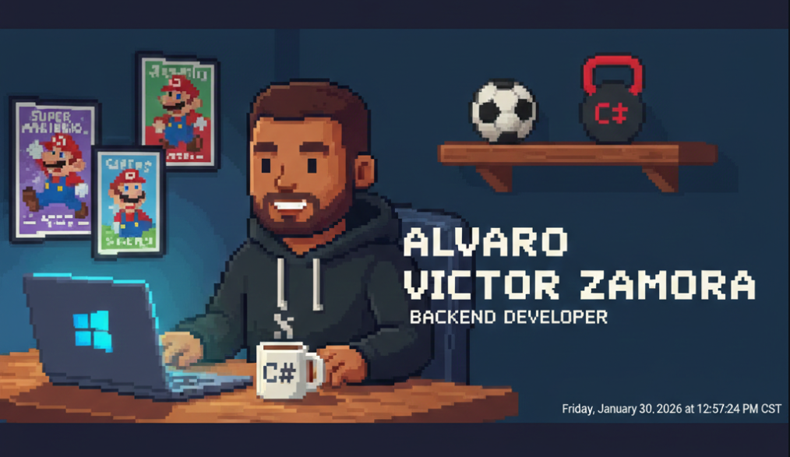

  

# Hi, Welcome to my Repository! 👋

### 🚀 Developer | .NET & Software Architecture Enthusiast

I'm a passionate Software Developer focused on building high-performance RESTful APIs and scalable distributed systems. My goal is to write clean, maintainable code while solving real-world problems through technology.

---

### 🌟 About Me  
- ☕ **Coffee Driven:** I believe everything is better with a strong, well-filtered coffee.
- 🏋️‍♂️ **Sport Addict:** I push my limits with **CrossFit**, **Soccer**, **Swimming**, and **Running**.
- 👨‍👩‍👧 **Family Oriented:** My main motivation to keep growing every day.
- 🎮 **Gamer at Heart:** Big fan of video games and retro aesthetics.
- 🛠️ **Future Focus:** Currently working on expanding my portfolio and exploring.

---

### 🛠️ Tech Stack & Skills

| Category | Technologies |
|---------|--------------|
| 🧠 Languages | C#, SQL, JavaScript, TypeScript, PHP, Python |
| ⚙️ Backend & Frameworks | .NET 8 (ASP.NET Core), Node.js (Express), Laravel |
| 🗄️ ORM & Data Access | Entity Framework Core |
| 🎨 Frontend | Angular, HTML5, CSS3 |
| 🧩 Architecture & Patterns | Clean Architecture, DDD, MVC, Unit of Work, Design Patterns |
| 🗃️ Databases | SQL Server, PostgreSQL, MongoDB |
| 🛠️ Tools & DevOps | Docker, Git, Swagger, Azure DevOps, Render, Netlify, phpMyAdmin |
| 🔐 Security & Auth | JWT |

---

### ☕ Featured Project: [CoffeeLocator](https://github.com/alvi014/CoffeeLocator)
*A RESTful API in active development, focused on clean architecture and scalable backend design.*

🚧 **Status:** Work in Progress  

**Tech highlights:**
- Built with **.NET 8** and **Clean Architecture**
- **JWT Authentication** for secure access
- **Geographic Proximity Search** (location-based coffee shops)
- Designed with **Domain-Driven Design (DDD)** principles in mind
- API-first approach, documented with **Swagger**

📌 *The project is currently under active development, with features and architecture evolving incrementally.*

👉 **[Explore all my repositories](https://github.com/alvi014?tab=repositories)**

---

### 📈 GitHub Activity
*Consistent activity focused on backend development, architecture practices, and continuous learning.*

  

---

### 📫 Let's Connect!

---
*"Code is like coffee: it's better when it's strong and well-filtered."* ☕
